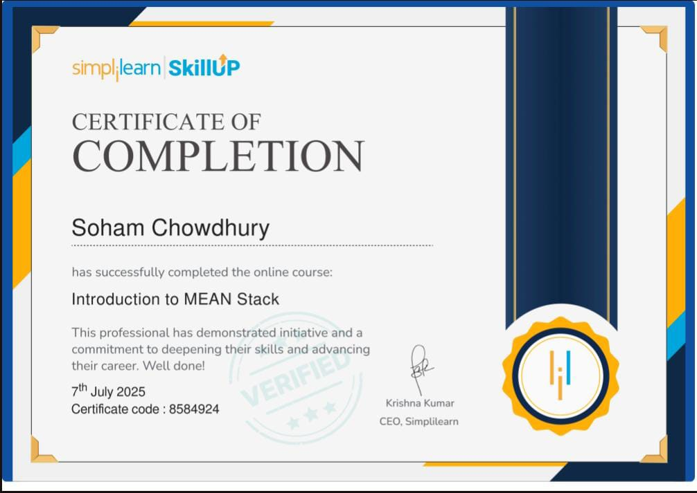

<h1 align="center">Hi 👋, I'm Soham</h1>
<h3 align="center">A Passionate Full-Stack Developer from India 🇮🇳</h3>

  

---

### 🧑‍💻 About Me

- 🔭 I’m currently working on **MERN Projects**
- 🌱 I’m currently learning **TypeScript & Docker**
- 💬 Ask me about **JavaScript, React, Node.js, MongoDB**
- 📫 How to reach me: [**LinkedIn**](https://www.linkedin.com/in/soham-chowdhury-429540320/)
- ⚡ Fun fact: I love making complex things simple!

---

### 🌐 Connect with Me:

---

### 💻 Tech Stack:

  
  
  
  
  
  
  
  
  

---

### 📈 GitHub Stats:

  
  

---
### 📜 Certifications

- 🏅 Introduction to MEAN Stack – Simplilearn  
  - Issued by: Simplilearn SkillUp  
  - Date: July 2025  
  - Certificate ID: 8584924
